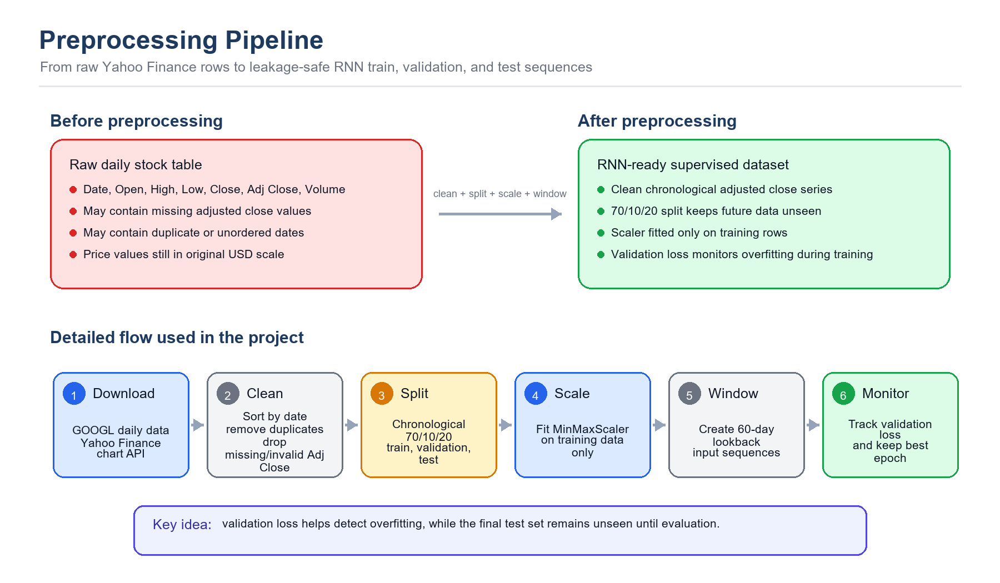
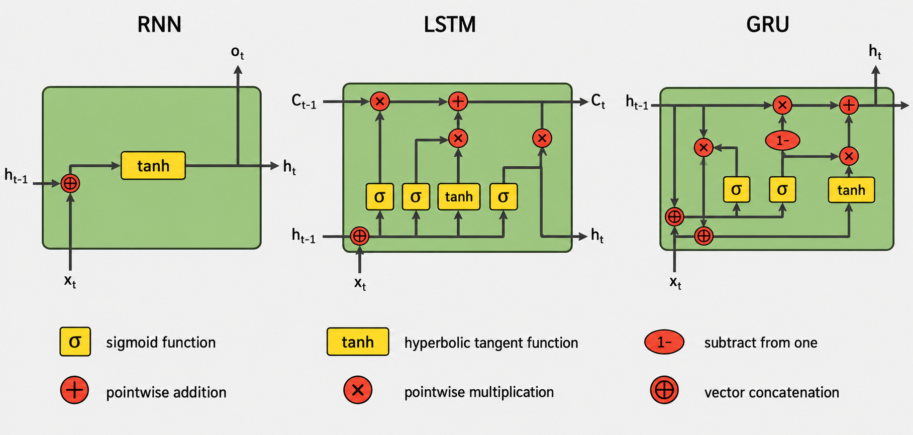
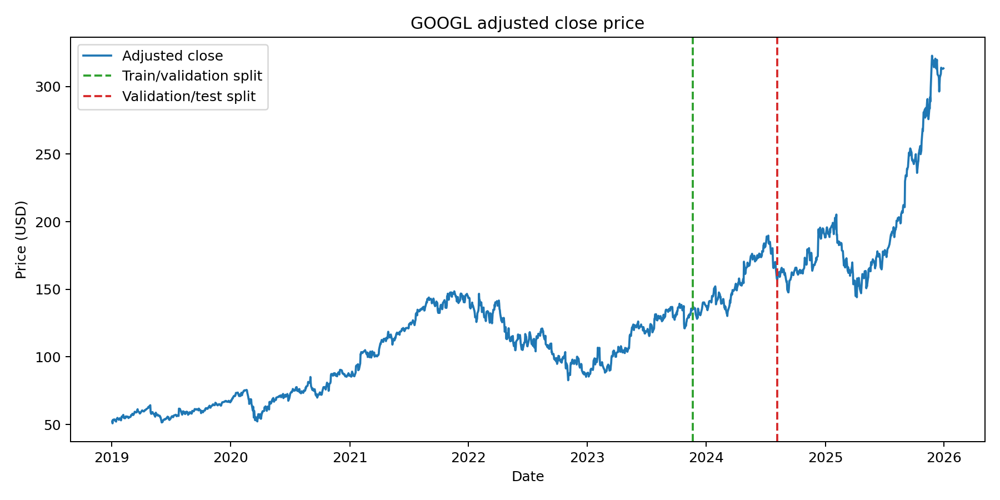
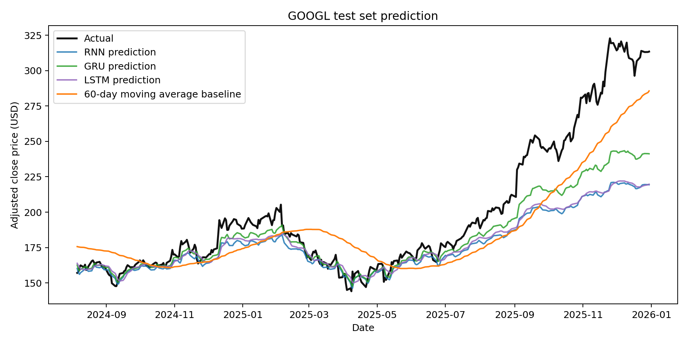
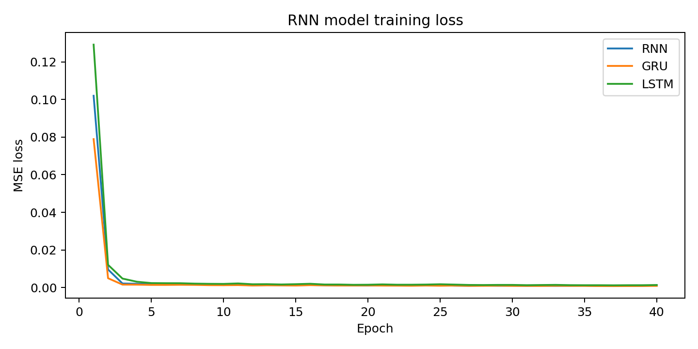
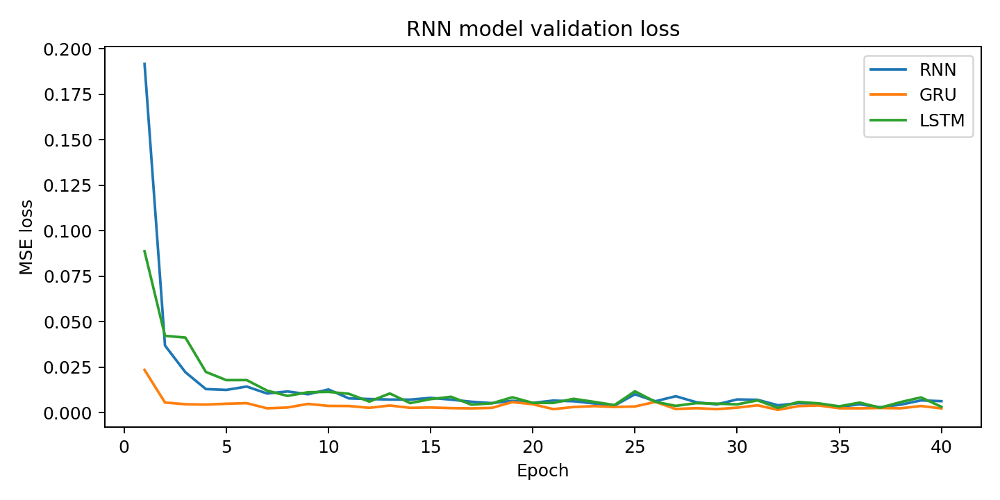
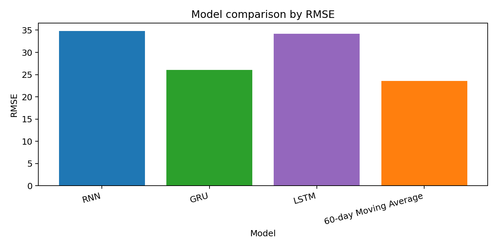

# Stock Price Prediction Using RNN-Based Models

## 1. Data Collection and Preprocessing

This project predicts Alphabet Inc. Class A stock prices using historical daily price data for GOOGL. The dataset was obtained from the public Yahoo Finance chart data endpoint through the Python script in `src/train_stock_rnn.py`. The final downloaded dataset covers 2019-01-02 to 2025-12-30 and contains 1,759 cleaned daily observations.

The target variable is the adjusted closing price because it accounts for corporate actions such as stock splits and dividends more consistently than raw close price. The raw data includes Date, Open, High, Low, Close, Adjusted Close, and Volume.

The data cleaning and preprocessing steps were:

1. **Data cleaning:** The data was sorted by date to preserve the time-series order. Duplicate dates were removed so that each trading day appeared only once. Rows with missing adjusted close prices were removed because the adjusted close price is the prediction target. Invalid rows with non-positive adjusted close prices were also removed because stock prices cannot be zero or negative in this context.
2. **Train/validation/test split:** The cleaned dataset was split chronologically into 70% training data, 10% validation data, and 20% testing data. A chronological split was used instead of a random split because stock prediction is a time-series problem, and future data must not be leaked into the training stage.
3. **Normalization:** The adjusted close price was normalized using `MinMaxScaler`. The scaler was fitted only on the training set, then applied to the validation and testing data. This prevents information from later periods from influencing the training process.
4. **Sequence conversion:** The normalized price series was converted into supervised learning sequences using a 60-day lookback window. For each sample, the previous 60 adjusted closing prices were used as input features, and the next trading day's adjusted close price was used as the target output.

The overall preprocessing workflow is summarized in the visual aid below. It shows how the raw stock table is transformed into leakage-safe RNN input sequences.



In the source code, the `load_and_clean_data()` function performs the sorting, duplicate removal, missing-value removal, and invalid-price filtering. The `MinMaxScaler` section performs normalization, the validation set monitors overfitting during training, and the `build_sequences()` function converts the cleaned price data into RNN-ready input sequences.

The following preprocessing code shows how the dataset was cleaned before training:

```python
def load_and_clean_data():
    if not DATA_PATH.exists():
        download_yahoo_chart(SYMBOL, START_DATE, END_DATE)

    df = pd.read_csv(DATA_PATH, parse_dates=["Date"])
    df = df.sort_values("Date").drop_duplicates("Date")
    df = df.dropna(subset=["Adj Close"])
    df = df[df["Adj Close"] > 0].reset_index(drop=True)
    return df
```

The chronological split and scaler fitting were also kept separate to reduce data leakage:

```python
train_end_index = int(len(df) * (1 - VALIDATION_RATIO - TEST_RATIO))
validation_end_index = int(len(df) * (1 - TEST_RATIO))
train_close = df.loc[: train_end_index - 1, ["Adj Close"]]

scaler = MinMaxScaler()
scaler.fit(train_close)
scaled_close = scaler.transform(df[["Adj Close"]])
```

The cleaned and scaled series was converted into 60-day input windows using this sequence-building function:

```python
def build_sequences(values, lookback):
    x, y = [], []
    for idx in range(lookback, len(values)):
        x.append(values[idx - lookback : idx])
        y.append(values[idx])
    return np.array(x, dtype=np.float32), np.array(y, dtype=np.float32)
```

## 2. Investigation of the Proposed Machine Learning Technique

The proposed machine learning technique is an RNN-based time-series forecasting model. RNNs are designed for sequential data because they process observations in order and maintain hidden states that represent information from previous time steps. This makes them suitable for stock price prediction, where recent and medium-term historical prices can influence the next predicted value.

Three RNN-based models were investigated: a vanilla RNN, a Gated Recurrent Unit model, and a Long Short-Term Memory model. A vanilla RNN is the simplest recurrent model and updates its hidden state at each time step. However, it can struggle with long-term dependencies because gradients may vanish or explode during backpropagation through time.

GRU improves the standard RNN by using update and reset gates. These gates help the model decide how much past information should be kept and how much new information should be added. GRU is usually simpler than LSTM because it has fewer gates, so it can train faster while still handling sequential dependencies effectively.

LSTM improves the standard RNN by using input, forget, and output gates with a memory cell. These gates control how information is stored, updated, and forgotten. LSTM is powerful for longer sequences, but it has more parameters than GRU and may require more data or tuning to perform best.

The models used in this project share the same main setup:

- Input size: 1 feature, the normalized adjusted close price.
- Lookback window: 60 trading days.
- Two recurrent layers.
- Hidden size: 64.
- Dropout: 0.20 to reduce overfitting.
- Fully connected regression layers to output the next predicted price.
- Adam optimizer with learning rate 0.001.
- Mean squared error loss.
- 40 training epochs.
- Validation loss monitoring, with the best-validation epoch restored before final test evaluation.

After comparison, GRU was selected as the best proposed model for this dataset because it achieved the lowest test error among the RNN-based models.

The diagram below compares the internal structures of RNN, LSTM, and GRU. It shows that the basic RNN mainly transforms the current input and previous hidden state through a `tanh` layer, while LSTM and GRU add gating operations using sigmoid functions, pointwise multiplication, and pointwise addition to control how much information is kept or forgotten.



The shared PyTorch model class made the comparison fair because the recurrent cell type was the main component changed between RNN, GRU, and LSTM:

```python
class StockRecurrentModel(nn.Module):
    def __init__(self, cell_type, input_size=1, hidden_size=64,
                 num_layers=2, dropout=0.20):
        super().__init__()
        recurrent_layers = {"RNN": nn.RNN, "GRU": nn.GRU, "LSTM": nn.LSTM}
        self.recurrent = recurrent_layers[cell_type](
            input_size=input_size,
            hidden_size=hidden_size,
            num_layers=num_layers,
            batch_first=True,
            dropout=dropout,
        )
        self.regressor = nn.Sequential(
            nn.Linear(hidden_size, 32),
            nn.ReLU(),
            nn.Linear(32, 1),
        )

    def forward(self, x):
        output, _ = self.recurrent(x)
        return self.regressor(output[:, -1, :])
```

### Comparison of RNN, GRU, and LSTM

**Table 1. Comparison of RNN, GRU, and LSTM models.**

| Model | Good points | Bad points |
|---|---|---|
| RNN | Simple structure, fast to train, and easy to understand. It can model short-term sequential patterns and is useful as a basic recurrent baseline. | Struggles with long-term dependencies because of vanishing or exploding gradients. It may forget older information in the 60-day sequence and usually performs worse than gated models. |
| GRU | Uses update and reset gates, so it handles sequence memory better than a basic RNN. It has fewer parameters than LSTM, trains efficiently, and achieved the best result in this experiment. | Less expressive than LSTM in some complex long-sequence problems. It can still overfit and still depends heavily on the quality of historical price data. |
| LSTM | Uses input, forget, and output gates with a memory cell, making it strong for longer-term dependencies. It is widely used for time-series prediction and can model complex temporal patterns. | More complex than RNN and GRU, with more parameters and higher training cost. On this single-feature GOOGL dataset, it performed worse than GRU, possibly because the extra complexity was not needed. |

## 3. Model Development, Evaluation, and Visualization

The model was implemented using Python and PyTorch. Pandas and NumPy were used for data handling, scikit-learn was used for scaling and evaluation metrics, and Matplotlib was used for visualization.

The RNN, GRU, and LSTM models were compared with a simple 60-day moving average baseline. The baseline predicts the next price as the average adjusted close price of the previous 60 trading days. This is useful because a machine learning model should perform better than a simple time-series heuristic to justify its complexity.

The training loop used mini-batch gradient descent, mean squared error loss, the Adam optimizer, and validation-loss monitoring:

```python
model = StockRecurrentModel(model_name).to(device)
loss_fn = nn.MSELoss()
optimizer = torch.optim.Adam(model.parameters(), lr=LEARNING_RATE)
best_val_loss = float("inf")

for epoch in range(EPOCHS):
    model.train()
    for batch_x, batch_y in train_loader:
        batch_x = batch_x.to(device)
        batch_y = batch_y.to(device)
        optimizer.zero_grad()
        prediction = model(batch_x)
        loss = loss_fn(prediction, batch_y)
        loss.backward()
        optimizer.step()

    model.eval()
    with torch.no_grad():
        val_loss = loss_fn(model(val_x), val_y)
        if val_loss.item() < best_val_loss:
            best_val_loss = val_loss.item()
            best_state = deepcopy(model.state_dict())
```

The evaluation function calculated the same four metrics used in the results table:

```python
def evaluate(y_true, y_pred):
    rmse = math.sqrt(mean_squared_error(y_true, y_pred))
    mae = mean_absolute_error(y_true, y_pred)
    mape = np.mean(np.abs((y_true - y_pred) / y_true)) * 100
    r2 = r2_score(y_true, y_pred)
    return {"RMSE": rmse, "MAE": mae, "MAPE": mape, "R2": r2}
```

### Evaluation Metrics

**Table 2. Model evaluation metrics on the test set.**

| Model | RMSE | MAE | MAPE | R2 |
|---|---:|---:|---:|---:|
| RNN | 34.83 | 21.53 | 8.78% | 0.456 |
| GRU | 26.06 | 15.54 | 6.28% | 0.695 |
| LSTM | 34.17 | 20.63 | 8.37% | 0.476 |
| 60-day Moving Average | 23.61 | 19.22 | 9.12% | 0.750 |

After adding validation monitoring, GRU remained the strongest RNN-based model. It achieved the lowest MAE and MAPE among all compared methods, but the 60-day moving average baseline achieved the lowest RMSE and highest R2. This indicates that GRU reduced average absolute percentage error well, while the simple baseline was still competitive on squared-error-based metrics.

### Visualizations

The full stock price history with train/validation/test split markers is shown in:



The test-set prediction comparison is shown in:



The training loss curves are shown in:



The validation loss curves are shown in:



The RMSE model comparison is shown in:



## 4. Critical Analysis

### Strengths

The selected GRU model has several strengths. Its main advantage is that it can learn sequential patterns from historical stock prices while using a simpler gated structure than LSTM. The update gate allows the model to keep useful past information, while the reset gate helps it decide when older information should be ignored. This is useful for stock data because recent price movement is important, but older trends may still contain useful context.

The numerical results support the choice of GRU as the strongest RNN-based model. GRU achieved RMSE = 26.06, MAE = 15.54, MAPE = 6.28%, and R2 = 0.695. Compared with the vanilla RNN and LSTM, GRU produced lower RMSE, MAE, and MAPE, showing that its update and reset gates handled the 60-day sequence more effectively. GRU also achieved lower MAE and MAPE than the 60-day moving average baseline, although the baseline still achieved a lower RMSE and higher R2.

Another strength of the project design is that it reduces data leakage. The train/validation/test split is chronological rather than random, which is more suitable for time-series forecasting because the model should only learn from past data and then predict future data. The MinMaxScaler was fitted only on the training set before being applied to the validation and test sets, so information from later periods was not used during normalization. The validation set was used to monitor generalization and select the best epoch before final testing.

### Limitations

However, the model has important limitations. First, there is still a risk of overfitting. RNN-based models contain many trainable parameters, and stock price data is noisy. A model may learn the shape of the training period well but fail when the market enters a different condition. Validation loss reduces this risk by showing whether performance improves on unseen validation data, but it does not guarantee reliable performance in future market regimes.

Second, the model is highly dependent on historical price data. This project uses only the adjusted closing price as the input feature. In real financial markets, stock prices are affected by many external variables, such as earnings announcements, interest rates, inflation, sector performance, market indexes, regulation, product news, and investor sentiment. Since these variables are not included, the model cannot directly respond to important information outside the price series.

Third, the model is sensitive to market volatility and sudden events. Unexpected events such as financial crises, product announcements, lawsuits, geopolitical shocks, or earnings surprises can change prices quickly. Because the GRU learns from historical patterns, it may react slowly to sudden turning points. This is especially important for stock prediction because strong test performance on historical data does not guarantee reliable prediction during unusual market conditions.

There are also evaluation limitations. The model was tested using one stock, one date range, and one chronological split. A stronger evaluation would use rolling-window validation, where the model is trained and tested across multiple time periods. This would show whether the model remains stable across different market conditions. The project also evaluates one-step-ahead prediction; longer forecasting horizons would likely be more difficult and should be tested separately.

Future improvements could include adding more input features such as trading volume, technical indicators, market index prices, interest rates, and sentiment features. Regularization methods such as early stopping, validation loss monitoring, and hyperparameter tuning could reduce overfitting risk. A Transformer-based time-series model could also be tested. Overall, the GRU model is effective for this experiment, but it should be viewed as a forecasting aid rather than a guaranteed predictor of future stock prices.

### Comparison with Alternative Models

The comparison with alternative models shows a trade-off between accuracy, simplicity, and evaluation metric. The moving average baseline is very easy to understand and does not require training; in this run it achieved the best RMSE and R2, showing that a simple baseline can remain strong for one-step stock prediction. GRU was the best neural model and achieved the best MAE and MAPE, meaning its average absolute prediction error was lower. The vanilla RNN was simpler than GRU and LSTM, but it performed worse because it has weaker memory handling. LSTM is more powerful in theory because it has a separate memory cell and three gates, but in this experiment its extra complexity did not improve performance. Therefore, GRU is the best RNN-based choice for this dataset, while the moving average baseline remains an important benchmark.

## Conclusion

This project designed and applied multiple RNN-based models for stock price prediction using public GOOGL historical financial data. The data was cleaned, normalized, split chronologically into training, validation, and testing sets, converted into 60-day sequences, and evaluated using RMSE, MAE, MAPE, and R2. GRU was the strongest RNN-based model and achieved the lowest MAE and MAPE, while the moving average baseline achieved the best RMSE and R2. This shows that recurrent neural networks can learn useful time-dependent patterns from historical stock data, but they must still be compared against simple baselines. The model remains limited by overfitting risk, dependence on historical prices, and sensitivity to unpredictable market volatility.

## Source Code

GitHub repository: [https://github.com/JoeVey22/ML_Summative_Assessment](https://github.com/JoeVey22/ML_Summative_Assessment)

Main training source file: `src/train_stock_rnn.py`
